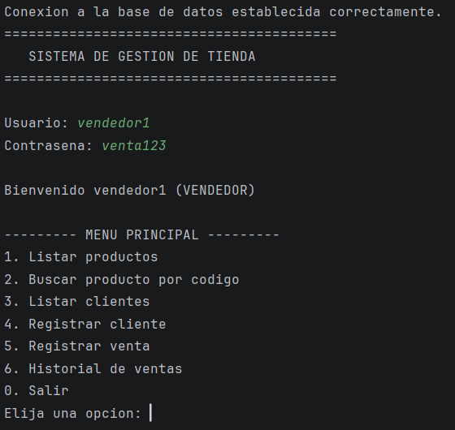
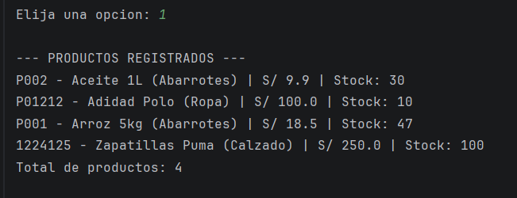
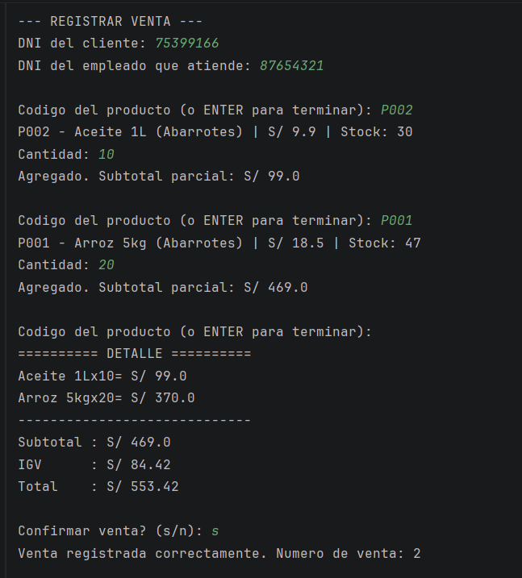
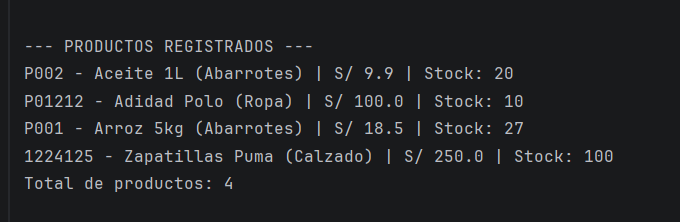

# gestion-tienda-java — Sistema de Gestión de Productos, Clientes y Ventas

Proyecto final del curso de Programación Orientada a Objetos.

## Descripción

Aplicación de consola en Java que permite administrar clientes, empleados, productos e inventario de
una tienda comercial, registrar ventas con cálculo automático de IGV, actualizar el stock y persistir
toda la información en una base de datos mediante JDBC.

## Integrantes y reparto de tareas

| Integrante | Parte a cargo |
|---|---|
| Katty Cai | **Modelo (POO)**: clases `Persona` (abstracta), `Cliente`, `Empleado`, `Producto`, `Venta`, `DetalleVenta`, `Usuario`. Herencia, encapsulamiento, polimorfismo (sobrescritura de método en `Cliente`/`Empleado`). |
| _Rodrigo Solano_ | **Persistencia (JDBC)**: `ConexionBD`, DAOs (`ClienteDAO`, `EmpleadoDAO`, `ProductoDAO`, `VentaDAO`, `UsuarioDAO`), script SQL de creación de la base de datos. |
| _Fabricio Santos_ | **Lógica de negocio**: cálculo de IGV/totales (Math), validaciones de datos (String), colecciones para inventario y detalle de venta, estructuras de control para las reglas del negocio. |
| Gustavo Ugarte | **Setup, interfaz de consola e integración**: configuración inicial del repositorio y del proyecto en IntelliJ (Maven, estructura de carpetas, `.gitignore`), menús por rol (administrador/vendedor), conexión entre vista-modelo-persistencia, pruebas de funcionamiento, y coordinación del README/GitHub/video. |

Todos los integrantes participan también en la revisión cruzada del código y en la sustentación grupal.

## Tecnologías utilizadas

- Java 17
- JDBC
- MySQL (u otro motor relacional)
- IntelliJ IDEA
- Maven

## Estructura del proyecto

```
gestion-tienda-java/
├── docs/
│   └── Analisis.md
├── sql/
│   └── script_creacion_bd.sql
├── src/
│   └── main/
│       └── java/
│           └── com/
│               └── lideratec/
│                   ├── model/
│                   │   ├── Persona.java
│                   │   ├── Cliente.java
│                   │   ├── Empleado.java
│                   │   ├── Producto.java
│                   │   ├── Venta.java
│                   │   ├── DetalleVenta.java
│                   │   └── Usuario.java
│                   ├── dao/
│                   │   ├── ClienteDAO.java
│                   │   ├── EmpleadoDAO.java
│                   │   ├── ProductoDAO.java
│                   │   ├── VentaDAO.java
│                   │   └── UsuarioDAO.java
│                   ├── bd/
│                   │   └── ConexionBD.java
│                   ├── service/
│                   │   └── VentaService.java
│                   ├── vista/
│                   │   └── MenuPrincipal.java
│                   └── Main.java
├── .gitignore
├── pom.xml
└── README.md
```

Cada capa tiene una responsabilidad clara: `model` define las entidades (POO),
`dao` accede a la base de datos con JDBC, `service` concentra las reglas de negocio
(validaciones y cálculo de IGV), `vista` contiene el menú de consola y `Main`
únicamente arranca la aplicación.

## Instrucciones de ejecución

1. Clonar el repositorio:
   ```
   git clone <url-del-repositorio>
   ```
2. Tener MySQL corriendo en `localhost:3306` con el usuario `root` y contraseña `root`.
   Estas credenciales son las que el equipo acordó usar y ya están configuradas en
   `src/main/java/com/lideratec/bd/ConexionBD.java`, por lo que no hace falta editar
   nada en el código.
3. Crear la base de datos ejecutando `sql/script_creacion_bd.sql` en MySQL. El script
   crea las tablas y carga datos de prueba (productos, un cliente, un empleado y dos usuarios).
4. Abrir el proyecto en IntelliJ IDEA como proyecto Maven. Maven descargará
   automáticamente el driver `mysql-connector-j` declarado en el `pom.xml`.
5. Ejecutar `Main.java`.

> Nota: al ser un proyecto académico las credenciales van fijas en el código para que
> todos los integrantes trabajen con la misma configuración. En un sistema real se
> externalizarían a un archivo `db.properties` fuera del control de versiones.

### Usuarios de prueba

| Usuario | Contraseña | Rol |
|---|---|---|
| `admin` | `admin123` | ADMINISTRADOR (ve todas las opciones) |
| `vendedor1` | `venta123` | VENDEDOR (solo consultas y ventas) |

## Funcionalidades del menú

- Iniciar sesión con validación de credenciales (máximo 3 intentos).
- Listar productos y buscarlos por código.
- Listar y registrar clientes, con validación de DNI (8 dígitos).
- Registrar ventas: se arma el carrito producto por producto, se valida el stock
  disponible, se calcula subtotal, IGV (18%) y total, y se guarda todo en una
  transacción que además descuenta el stock.
- Consultar el historial de ventas con su detalle y el monto acumulado.
- Opciones solo para administrador: registrar productos, actualizar stock y listar empleados.

## Evidencias de funcionamiento

### 1. Inicio de sesión y menú según el rol

El usuario `vendedor1` accede correctamente y el menú se genera según su rol: solo
ve las opciones 1 a 6, sin las de administrador (registrar producto, actualizar
stock y listar empleados).



### 2. Listado de productos antes de la venta

Se recuperan los productos desde MySQL. Al momento de la consulta, el Aceite 1L
(P002) tiene 30 unidades y el Arroz 5kg (P001) tiene 47.



### 3. Registro de una venta con cálculo automático de IGV

Se agregan dos productos al carrito validando el stock disponible en cada paso.
El sistema calcula subtotal (S/ 469.00), IGV del 18% (S/ 84.42) y total
(S/ 553.42), y registra la venta dentro de una transacción.



### 4. Stock actualizado tras la venta

Al volver a listar los productos se comprueba que el stock se descontó en la base
de datos: el Aceite 1L pasó de 30 a 20 unidades (se vendieron 10) y el Arroz 5kg
de 47 a 27 (se vendieron 20).



## Video de exposición

Enlace: https://youtu.be/tdjH8a2wn78
